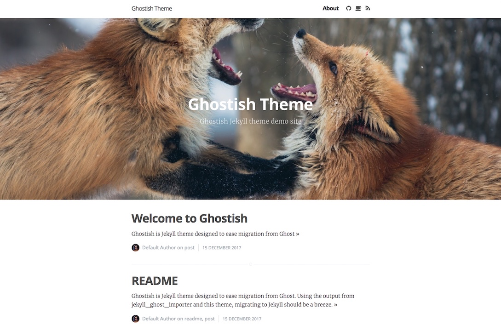

# ghostish-jekyll-theme

Ghostish is Jekyll theme designed to ease migration from [Ghost](https://ghost.org), by using the output from [jekyll_ghost_importer](https://github.com/eloyesp/jekyll_ghost_importer). When combined together with this theme migrating to Jekyll should be a breeze. The Ghostish design is inspired by Ghost's default Casper theme.

The jump to Ghost v1 caused many an issue to self-hosting users of the platform. In particular because from Ghost v1 they took the decision to only support their “recommended stack”, which consists of: Ubuntu 16.04, MySQL, NGINX, etc. I created this theme to aid my own migration from Ghost to Jekyll, therefore it makes a few assumptions which may not be relevant to everybody. Most notably it's setup for single author sites, but it shouldn't be too difficult to adjust to accommodate more.

## Details

### Demo

The theme is live on my own site: https://megalomaniacslair.co.uk/

### Screenshot



### Ghostish on GitHub

[ghostish-jekyll-theme](https://github.com/drmegalomaniac/ghostish)

### Ghostish on Ruby Gems

[ghostish-jekyll-theme](https://rubygems.org/gems/ghostish-jekyll-theme)

## Installation

Add this line to your Jekyll site's `Gemfile`:

```ruby
gem "ghostish-jekyll-theme"
```

And add this line to your Jekyll site's `_config.yml`:

```yaml
theme: ghostish-jekyll-theme
```

And then execute:

    $ bundle

Or install it yourself as:

    $ gem install ghostish-jekyll-theme

## Usage

### Importing content from Ghost

Export your content by following Ghost's instructions: https://help.ghost.org/hc/en-us/articles/224112927-Import-Export-Data

Import your posts into Jekyll using [jekyll_ghost_importer](https://github.com/eloyesp/jekyll_ghost_importer) to convert your Ghost json into Jekyll *\_posts* (and *\_drafts*).

    $ gem install jekyll_ghost_importer

    $ jekyll_ghost_importer your_ghost_export_file.json

The resulting *\_posts* folder can be used as per standard Jekyll posts. Simply copy it into your Jekyll site's directory.

You will also need to copy across your images, this theme uses the _content_ folder for images, as per Ghost, rather than the standard Jekyll *\_assets*. That way you simply need to copy across the whole _content_ directory from Ghost into your Jekyll site's directory.

### Plugins

This theme uses the plugins [jekyll-feed](https://rubygems.org/gems/jekyll-feed) (to create an Atom feed), [jekyll-tagging](https://rubygems.org/gems/jekyll-tagging) (for tag pages), [jekyll-paginate-v2](https://rubygems.org/gems/jekyll-paginate-v2) (for pagination) and [jekyll-tidy](https://rubygems.org/gems/jekyll-tidy) (for cleaner HTML output).

## Contributing

Bug reports and pull requests are welcome on GitHub at https://github.com/drmegalomaniac/ghostish. This project is intended to be a safe, welcoming space for collaboration, and contributors are expected to adhere to the [Contributor Covenant](http://contributor-covenant.org) code of conduct.

## License

The theme is available as open source under the terms of the [MIT License](https://opensource.org/licenses/MIT).
